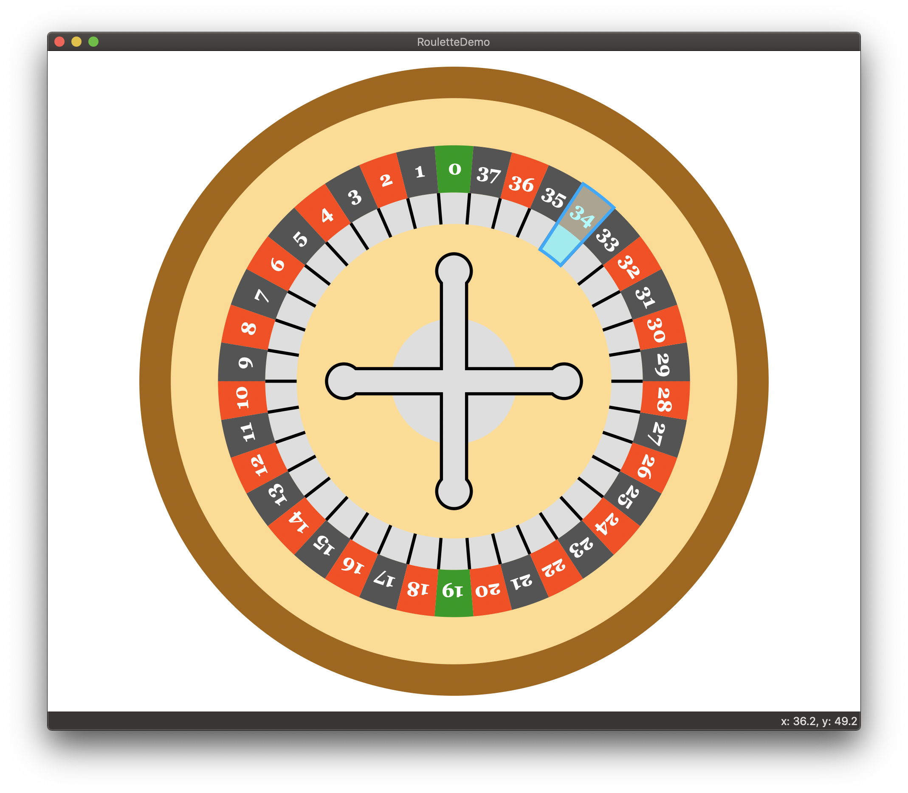

# SwiftWindows2DGraphics
A project to create a Quartz2D style 2D graphics engine for Windows in native Swift

When you run the demo you will see the following roulette wheel graphic which has a hover animation for the pockets and central handle.

### Running on Mac

In the folder RouletteDemo_MacOS you will find an Xcode project in swift that when run will produce the roulette demo. 
This represents the target of what I am trying to achieve on Windows.

### Running on Windows

I intend to recreate the roulette demo on Windows using Swift on Windows. This will be achieved though getting the Windows 
Direct2D API to be accessible from Swift and then wrapping Direct2D such that it exposes an API much the same as Quartz2D 
on MacOS. Ultimately the aim is to achieve source code equality between the Windows and Mac roulette wheel demos. 

**work in progress**
